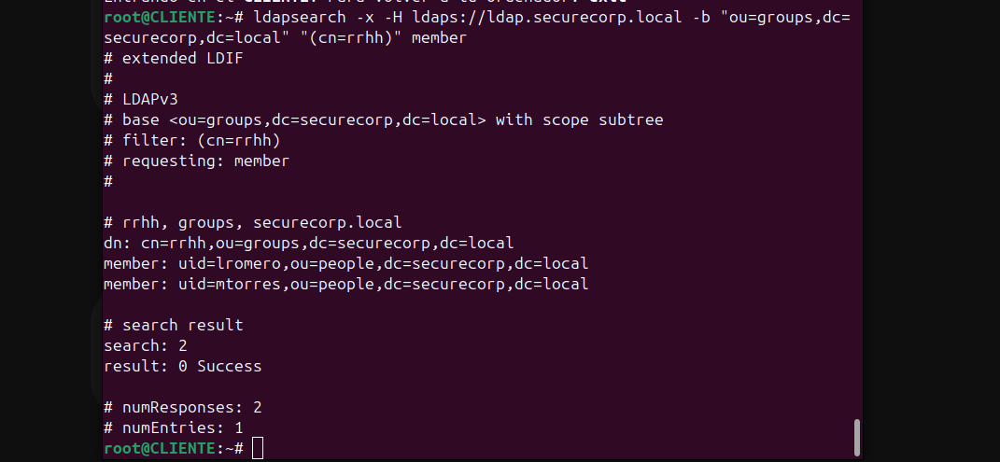

# Práctica 1 de SAD · SecureCorp — Respuestas

**Nombre y apellidos:** Juan Manuel Peinado Macias
**Usuario:** jpeinado

Responde con tus palabras, en 1-3 líneas. En la defensa te preguntaré lo mismo en voz alta.

**Contraseñas que has usado** (solo porque es un laboratorio; en una empresa, jamás en un fichero):

- Tu usuario: jpeinado
- mtorres: mtorres

---

**1. (A1)** ¿Quién es el `issuer` de tu `ca.crt`? ¿Hasta qué fecha es válido? ¿Por qué el `subject`
y el `issuer` de la CA son iguales y los de `ldap.crt` no?

El `issuer` de `ca.crt` es `CN=SecureCorp Root CA` y es válido hasta la fecha indicada en la CA (puedes verlo con `openssl x509 -in pki/ca/ca.crt -noout -dates`). Son iguales en la CA porque es un certificado autofirmado por ella misma, mientras que en `ldap.crt` el `subject` es el propio servidor LDAP y el `issuer` es la CA que lo firmó.

**2. (A3)** Pega el comando y el resultado de tus dos búsquedas:

ldapsearch -x -H ldaps://ldap.securecorp.local -b "ou=groups,dc=securecorp,dc=local" "(cn=rrhh)" member
# extended LDIF
#
# LDAPv3
# base <ou=groups,dc=securecorp,dc=local> with scope subtree
# filter: (cn=rrhh)
# requesting: member 
#

# rrhh, groups, securecorp.local
dn: cn=rrhh,ou=groups,dc=securecorp,dc=local
member: uid=lromero,ou=people,dc=securecorp,dc=local
member: uid=mtorres,ou=people,dc=securecorp,dc=local

# search result
search: 2
result: 0 Success

# numResponses: 2
# numEntries: 1

ldapsearch -x -H ldaps://ldap.securecorp.local -b "ou=people,dc=securecorp,dc=local" "(objectClass=inetOrgPerson)" cn mail
# extended LDIF
#
# LDAPv3
# base <ou=people,dc=securecorp,dc=local> with scope subtree
# filter: (objectClass=inetOrgPerson)
# requesting: cn mail 
#

# lromero, people, securecorp.local
dn: uid=lromero,ou=people,dc=securecorp,dc=local
cn: Lucia Romero
mail: lromero@securecorp.local

# jpeinado, people, securecorp.local
dn: uid=jpeinado,ou=people,dc=securecorp,dc=local
cn: Juan Manuel Peinado Macias
mail: jpeinado@securecorp.local

# mtorres, people, securecorp.local
dn: uid=mtorres,ou=people,dc=securecorp,dc=local
cn: Marta Torres
mail: mtorres@securecorp.local

# search result
search: 2
result: 0 Success

# numResponses: 4
# numEntries: 3

**3. (A4)** ¿Por qué la clave `ldap.key` tiene que ser de `openldap` y tener permisos 600?

Tiene permisos `600` para que ningún otro usuario del sistema pueda leer la clave privada del servidor, y la propiedad es del usuario `openldap` para que el servicio `slapd` tenga acceso exclusivo a ella y pueda cifrar las comunicaciones TLS.

**4. (A4)** ¿Qué valor has puesto en `SLAPD_SERVICES` y por qué?

Se configura `SLAPD_SERVICES="ldap:/// ldaps:///"` para que el demonio de OpenLDAP escuche peticiones tanto por el puerto estándar sin cifrar (389) como por el puerto cifrado mediante TLS/SSL (636).

**5. (A4)** Antes de añadir `TLS_CACERT` en el cliente, `ldaps://` no funcionaba. ¿Por qué?

Porque el equipo cliente no tenía almacenado el certificado de la CA que firmó el certificado de LDAP, por lo que no podía verificar la autenticidad del servidor al negociar el canal cifrado LDAPS.

**6. (B3)** Pega la salida de `klist` con tus dos tickets. ¿Para qué sirve cada uno? ¿Ha viajado tu
contraseña por la red?El ticket `krbtgt` (TGT) sirve para demostrar la identidad del usuario ante el KDC y solicitar tickets de servicio, mientras que el ticket `ldap/...` permite autenticarse en el servicio LDAP. La contraseña no ha viajado por la red; solo se usa de forma local para cifrar/descifrar la respuesta inicial del KDC.

**7. (C)** En el `docker-compose.yml`, ¿qué diferencia hay entre `build:` e `image:`? ¿Qué
significa la línea `- "8081:80"` del servicio `phpldapadmin`?

`build:` instruye a Docker a construir una imagen propia a partir de un `Dockerfile` local, mientras que `image:` descarga una imagen ya existente desde un repositorio. La línea `- "8081:80"` mapea el puerto 8081 de la máquina física al puerto 80 del contenedor web.

**8. (C)** ¿Por qué en la máquina `web` no has tenido que escribir a mano `TLS_CACERT`, y en el
cliente sí? ¿Qué pasaría con esa línea del cliente si hicieras `./lab.sh reset`?

En la máquina `web` se automatizó declarando la variable de entorno `ENV LDAPTLS_CACERT=/pki/ca/ca.crt` directamente en su `Dockerfile`. Si hicieras `./lab.sh reset`, la línea modificada a mano en el cliente se borraría porque el contenedor se reconstruiría desde cero.